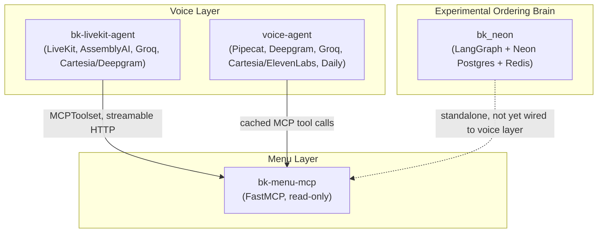
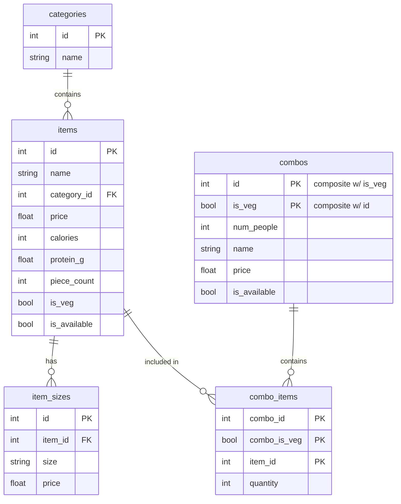

# 🍔🔊 DriveThruAI — BK VoiceAgent

### *A voice-native drive-thru ordering agent that queries only what it needs*

DriveThruAI is a multi-modal conversational AI system for Burger King drive-thru automation. It combines real-time audio streaming, speech-to-text, text-to-speech (with fallback), a read-only menu MCP server, and an experimental constraint-driven ordering brain — split across four subprojects, each owning one layer of the pipeline.

**Quick links:** [Subprojects](#subprojects) · [Architecture](#architecture) · [Getting Started](#getting-started) · [Environment Variables](#environment-variables) · [bk_neon Deep Dive](#bk_neon-constraint-driven-ordering-backend)

---

## Table of Contents

- [Why this exists](#why-this-exists)
- [Subprojects](#subprojects)
- [Architecture](#architecture)
- [Getting Started](#getting-started)
- [Environment Variables](#environment-variables)
- [bk_neon: Constraint-Driven Ordering Backend](#bk_neon-constraint-driven-ordering-backend)
  - [Core ideas](#core-ideas)
  - [Tech stack](#tech-stack)
  - [Database schema](#database-schema)
  - [Project structure](#project-structure)
  - [Testing](#testing)
- [Roadmap](#roadmap)
- [License](#license)

---

## Why this exists

Most "AI drive-thru" demos work by stuffing the whole menu into a system prompt and hoping the model picks the right combo of items out of a hundred-line wall of text. That's slow, expensive, and gets worse as the menu grows.

DriveThruAI flips the order of operations. On the voice side, the agent calls out to a dedicated, read-only menu server over MCP instead of holding the catalog in-context. On the experimental ordering-brain side (`bk_neon`), a LangGraph state machine fills a small set of constraint slots (budget, veg/non-veg, party size) by asking whichever question narrows the menu the most — measured against the real database, not guessed — and only queries Postgres once it has enough to return a tight, relevant candidate set.

## Subprojects

The repository is partitioned into distinct pieces, each targeting one layer of the voice-agent pipeline:

| Subproject | Role |
| --- | --- |
| **`bk-menu-mcp`** | A read-only MCP server (built on FastMCP) exposing Burger King menu items, categories, and combos as callable tools (`get_item`, `list_items`, `get_combo`, `search_items`). Deployable to Render. |
| **`bk-livekit-agent`** | A LiveKit worker agent (`BKAgent`) handling room lifecycles, the system prompt, and tool execution against the menu MCP server. Uses AssemblyAI STT, Groq (Llama 3.3 70B) for inference, and Cartesia TTS with Deepgram Aura as fallback. |
| **`voice-agent`** | An alternate Pipecat-based voice pipeline (Hindi ordering bot) using Deepgram nova-3 STT, Groq Llama LLM, Cartesia primary TTS with ElevenLabs automatic failover, and Daily as the WebRTC transport. Adds an in-memory, no-TTL cache around MCP tool calls, since menu data is read-only for the life of the process. |
| **`bk_neon`** | An experimental LangGraph state graph and Neon Postgres backend implementing constraint-driven, max-info-gain slot filling for order construction — the deep dive is [below](#bk_neon-constraint-driven-ordering-backend). |

## Architecture



The menu MCP server runs as an independent HTTP service that either voice agent queries as a tool source. `bk_neon` is developed as a separate, standalone ordering brain (see its [roadmap](#roadmap) item on wiring it into the live pipeline).

## Getting Started

Each subproject manages its own dependencies with [`uv`](https://docs.astral.sh/uv/) and pins Python 3.12.

### 1. Clone the repo

```bash
git clone https://github.com/singhsrj/DriveThruAI---BK-VoiceAgent--.git
cd DriveThruAI---BK-VoiceAgent--
```

### 2. Start the menu MCP server

```bash
cd bk-menu-mcp
cp .env.example .env   # fill in DATABASE_URL
uv sync
uv run server.py
```

Verify it's up with a quick HTTP request to its `/mcp` endpoint.

### 3. Start a LiveKit server (dev mode)

```bash
docker run --rm -it -p 7880:7880 -p 7881:7881 -p 7882:7882/udp \
  livekit/livekit-server --dev
```

The `--dev` flag binds the fixed `devkey` / `secret` credentials used in `bk-livekit-agent/env.example`.

### 4. Run the LiveKit voice agent

```bash
cd bk-livekit-agent
cp env.example .env   # fill in LIVEKIT_*, ASSEMBLYAI_API_KEY, GROQ_API_KEY, CARTESIA_API_KEY, DEEPGRAM_API_KEY, MCP_SERVER_URL
uv sync
uv run bot.py console   # or: uv run bot.py dev
```

`console` runs the full pipeline locally through your machine's mic/speakers with no browser or LiveKit room needed; `dev`/`start` run it as a worker listening for room-dispatch events.

### 5. (Alternative) Run the Pipecat voice agent

```bash
cd voice-agent
cp env.example .env
uv sync
uv run bot.py
```

### 6. (Experimental) Set up bk_neon

See the [bk_neon setup instructions](#bk_neon-constraint-driven-ordering-backend) below — it runs independently against its own Neon Postgres + Upstash Redis instances.

## Environment Variables

| Variable | Used by | Notes |
| --- | --- | --- |
| `DATABASE_URL` | `bk-menu-mcp`, `bk_neon` | Postgres connection string (`postgres://` and `postgresql://` both accepted, normalized internally) |
| `DATABASE_URL_DIRECT` | `bk_neon` (Alembic) | Direct, non-pooled Neon string — DDL through a pooler can deadlock |
| `REDIS_URL` | `bk_neon` | `rediss://` TCP protocol — Upstash's REST `https://` URL will not work |
| `LIVEKIT_URL` | `bk-livekit-agent` | WebSocket endpoint, e.g. `ws://localhost:7880` |
| `LIVEKIT_API_KEY` / `LIVEKIT_API_SECRET` | `bk-livekit-agent` | `devkey` / `secret` in local dev |
| `ASSEMBLYAI_API_KEY` | `bk-livekit-agent` | Streaming STT |
| `GROQ_API_KEY` | `bk-livekit-agent`, `voice-agent` | LLM inference (e.g. Llama 3.3 70B) |
| `CARTESIA_API_KEY` / `CARTESIA_VOICE_ID` | `bk-livekit-agent`, `voice-agent` | Primary low-latency TTS |
| `DEEPGRAM_API_KEY` / `DEEPGRAM_VOICE` | `bk-livekit-agent` | Fallback TTS (Aura); also STT (nova-3) in `voice-agent` |
| `MCP_SERVER_URL` | `bk-livekit-agent` | Must end in `/mcp` so the LiveKit MCP client uses streamable HTTP rather than SSE |
| `MEMORY_MCP_URL` | `voice-agent` | Optional long-term customer-memory MCP endpoint |

---

## bk_neon: Constraint-Driven Ordering Backend

*The BK Voice Agent brain that thinks before it talks.*

**Queries only what it needs — max-info-gain slot filling, composite-key combo modeling, and a fully async stack.**

### Core ideas

**1. Max-info-gain slot filling.** Instead of a scripted question order, the agent measures — against the live database — how much each unfilled slot (`veg_pref`, `budget_total`, `num_people`) would shrink the candidate item set if answered, and asks whichever one shrinks it the most. For each candidate answer to a slot, it counts how many items would remain, averages across answers, and compares that to the current count; the slot with the biggest expected drop gets asked first. Add or remove menu items and the agent re-derives which question is most useful, without anyone touching the prompt. A hard cap of 2 questions prevents interrogating the customer forever if answers are vague or slots keep tying.

**2. Composite-key combos: veg / non-veg as first-class variants.** Every combo family (Classic, Value, Feast, Party) exists as two rows sharing one `id`, differentiated by `is_veg` — a genuine composite primary key `(id, is_veg)`. `combo_items` carries the matching composite foreign key, so a non-veg Feast Combo can never accidentally serve a veg-flagged burger — enforced at the schema level, not just in application code. Combos also scale by `num_people`, with item quantities and price generated programmatically from real item prices plus a bundle discount.

**3. Redis caching layer.** The same Redis instance backing the job queue caches candidate-item/candidate-combo lookups. Cache keys are derived from a hash of the filled constraint slots, so different customers with the same constraints ("cheap non-veg combo") share a cache entry and skip the database entirely; admin-side price or availability updates invalidate the relevant keys rather than waiting out a TTL.

**4. Async everything.** Database access, ORM sessions, LangGraph nodes, and even Alembic migrations are async — `asyncpg` instead of `psycopg2`, `AsyncSession` instead of `Session`, `app.ainvoke()` instead of `app.invoke()`. Alembic's core migration runner is sync by design, so migrations bridge into the async engine via SQLAlchemy's `run_sync()` pattern.

**5. Background workers.** Anything that doesn't need to happen before the agent can keep talking — order confirmation (SMS/kitchen display/printer webhook), periodic combo price recalculation — is handed to an `arq` worker. `arq` was chosen over Celery because it's natively `asyncio`-based, so worker jobs `await` the same `AsyncSession` code the rest of the app uses.

### Tech stack

| Layer | Choice | Why |
| --- | --- | --- |
| Database | [Neon](https://neon.tech) (serverless Postgres) | Branching, autoscaling, generous free tier |
| ORM | SQLAlchemy 2.0 (async) | Composite keys, typed models, mature async support |
| Migrations | Alembic (async) | Standard, autogenerate-capable, version-controlled schema |
| Driver | `asyncpg` | Fastest async Postgres driver for Python |
| Agent orchestration | LangGraph | Native interrupts, checkpointed state, conditional routing |
| Cache + queue broker | Redis (Upstash) | One instance, two jobs: response caching and `arq`'s job queue |
| Background jobs | `arq` | Natively async, no sync/async bridging |
| Voice I/O | Pipecat / LiveKit Agents | STT/TTS pipelines, barge-in, turn-taking |

### Database schema



`combos(id, is_veg)` and `combo_items(combo_id, combo_is_veg, item_id)` are genuine composite keys enforced by Postgres — see `test_schema.py` for the checks that prove it.

### Project structure

```
bk_neon/
├── database.py         # async engine/session, Neon URL normalization
├── models.py            # SQLAlchemy models (composite-key combos included)
├── constraints.py       # slot schema for the ordering agent
├── info_gain.py         # max-info-gain question selector
├── query_builder.py     # async candidate-item/combo queries
├── cache.py              # Redis cache-aside layer for candidate queries
├── agent_graph.py        # async LangGraph ordering state machine
├── seed.py               # idempotent async data seeding
├── worker.py              # arq background worker (order confirmation, price sync)
├── enqueue_test_job.py   # example: enqueue a job onto the worker
├── requirements.txt
├── alembic.ini
└── alembic/
    ├── env.py             # async migration runner
    └── versions/
        └── ..._initial_schema.py
```

**Setup:**

```bash
cd bk_neon
python -m venv venv && source venv/bin/activate   # Windows: venv\Scripts\activate
pip install -r requirements.txt
cp .env.example .env   # DATABASE_URL, DATABASE_URL_DIRECT, REDIS_URL
alembic upgrade head
python seed.py
```

**Run:**

```bash
arq worker.WorkerSettings     # separate terminal — standalone service
python agent_graph.py
python enqueue_test_job.py    # optional: enqueue a test background job
```

### Testing

```bash
python test_schema.py
```

Runs the full pipeline against a throwaway database and checks, among other things:

- All expected tables/columns exist
- The `(id, is_veg)` composite PK on `combos` is actually enforced (not just present)
- Every generated combo has exactly one veg + one non-veg variant
- No non-veg combo variant ever resolves to a veg-flagged item
- Combo price strictly increases with `num_people`
- Realistic query patterns (budget filters, protein filters, group orders) return sane results

---

## Roadmap

- [ ] Wire `bk_neon`'s ordering brain into the live voice pipeline (`bk-livekit-agent` / `voice-agent`)
- [ ] Wire `present_options` to a live LLM call (currently a stub returning the candidate set)
- [ ] Full cart/order-total tracking in `AgentState` so the graph loops through a full order instead of stopping after one query
- [ ] Real order persistence (`orders` table) instead of the current stubbed `confirm_order` job
- [ ] Cache invalidation hooks on item/price updates instead of TTL-only expiry

## License

MIT
